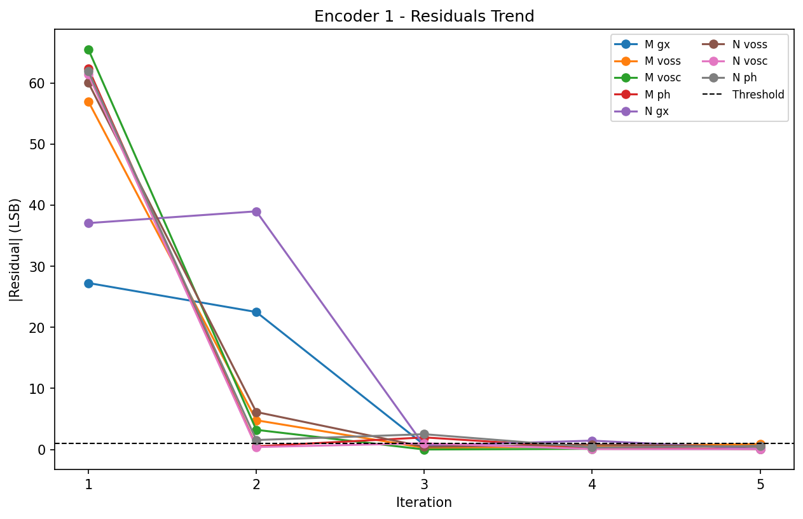

# iC-Haus Magnetic Encoder Calibration

Calibrate iC-MU magnetic encoders on Novanta/Ingenia drives using BiSS over EtherCAT.

## What it does

This tool runs the analog calibration procedure for iC-MU encoders connected
to a drive via EtherCAT. It spins the motor with an internal signal generator,
captures raw ADC data from the master and nonius tracks through PDOs, and
iteratively adjusts the encoder's analog parameters (gain, offset, phase) until
the residuals converge below a threshold. The final calibration is saved to the
encoder's EEPROM.

## Prerequisites

- Python 3.12
- A Novanta/Ingenia drive with iC-MU encoder(s) connected via EtherCAT
- The XDF dictionary file for your drive
- An EtherCAT network interface (e.g. `\Device\NPF_{...}`)
- The `mu-3sl` library

## Installation

1. Place the `mu-3sl` library file `.whl` inside the `/libs` folder. 

    Check README on `/libs` folder for further information.

2. Create the environment.

    This will create the virtual environment on a `/.venv` folder and will install all the needed dependencies:

    ```bash
    pip install poetry
    poetry install
    ```

    This step will fail if the correct mu-3sl library file has not been placed on the `/libs` folder.

## Usage

1. Activate the environment.

    ```bash
    source .venv/Scripts/activate
    ```

2. Run the script.

    These are example options:

    ```bash
    python __main__.py \
        --interface "\Device\NPF_{YOUR-ADAPTER-GUID}" \
        --dictionary path/to/drive.xdf \
        --encoder both
    ```

    Adapter GUID can be obtained by running these commands on a python terminal:
    ```python
    from ingeniamotion import MotionController
    mc = MotionController()
    net_adapters = mc.communication.get_network_adapters()
    for nice_name, ifname in net_adapters.items():
        print(f"{nice_name}: \\\\Device\\\\NPF_{ifname}")
        # Example output:
        # Intel(R) Ethernet Connection (13) I219-LM: \Device\NPF_{7B84A7B7-2506-44FE-89C3-D97DA2FD2869}
        # ...
    ```


### Key options

| Option                | Default | Description                                  |
|-----------------------|---------|----------------------------------------------|
| `--interface`         | —       | EtherCAT network interface name (required)   |
| `--dictionary`        | —       | Path to XDF dictionary file (required)       |
| `--encoder`           | `both`  | Which encoder(s): `1`, `2`, or `both`        |
| `--max-iterations`    | `10`     | Maximum analog calibration iterations        |
| `--gen-frequency`     | `0.4`   | Saw-tooth generator frequency (Hz)           |
| `--gen-current`       | `1.0`   | Quadrature current (A)                       |
| `--pdo-rate-ms`       | `1.0`   | PDO cycle time (ms)                          |
| `--capture-duration`  | `30.0`  | Data capture duration per iteration (s)      |
| `--output-dir`        | `calibration_output` | Directory for plots and JSON    |
| `--save-json`         | `true`  | Export calibration data as JSON              |
| `--verbose`           |         | Enable debug logging                         |

Run `python __main__.py --help` for the full list.

## Calibration outputs folder

After calibration, the `calibration_output/` directory contains diagnostic plots
and JSON data for each encoder. The residuals trend shows how the analog
parameters converge across iterations:



## Running tests

```bash
# Unit tests (no hardware required)
pytest tests/ -m "not hardware"

# Hardware tests (requires a connected drive)
pytest tests/ -m hardware --setup=tests.setups.tests_setup.MY_SETUP
```

## Project structure

| Path | Description |
|------|-------------|
| `__main__.py` | CLI entry point |
| `ic_haus_magnetic_encoder_calibration/calibrator.py` | Calibration orchestration |
| `ic_haus_magnetic_encoder_calibration/encoder.py` | Single encoder BiSS operations |
| `ic_haus_magnetic_encoder_calibration/motor_control.py` | Motor control with FSoE support |
| `ic_haus_magnetic_encoder_calibration/ic_haus_registers.py` | iC-MU register definitions |
| `ic_haus_magnetic_encoder_calibration/plotting.py` | Diagnostic plots |
| `architecture.md` | Detailed architecture documentation |

## Further reading

See [architecture.md](architecture.md) for a detailed explanation of the iC-MU
encoder, the calibration algorithm, register layout, and design decisions.
