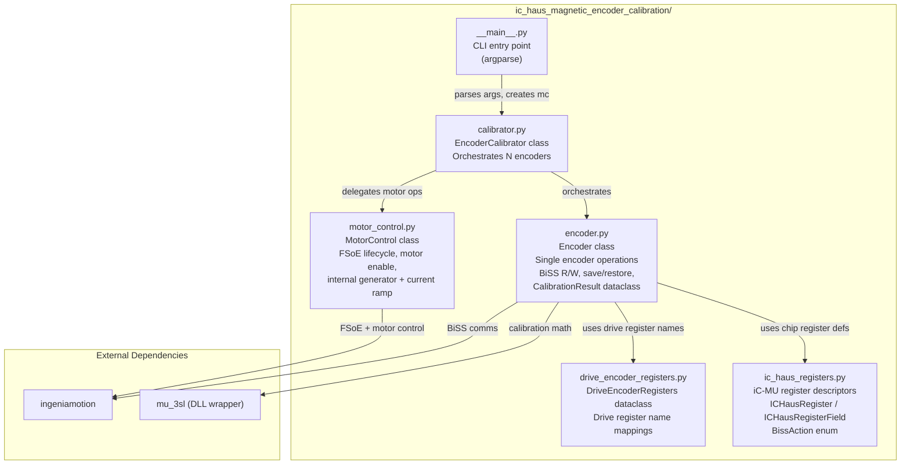
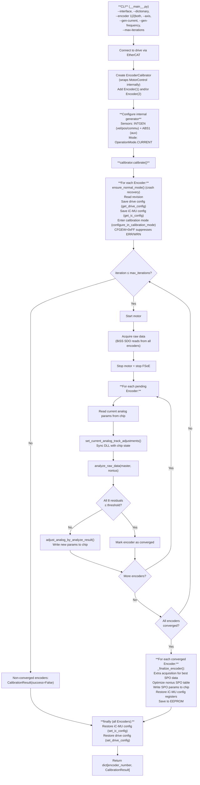
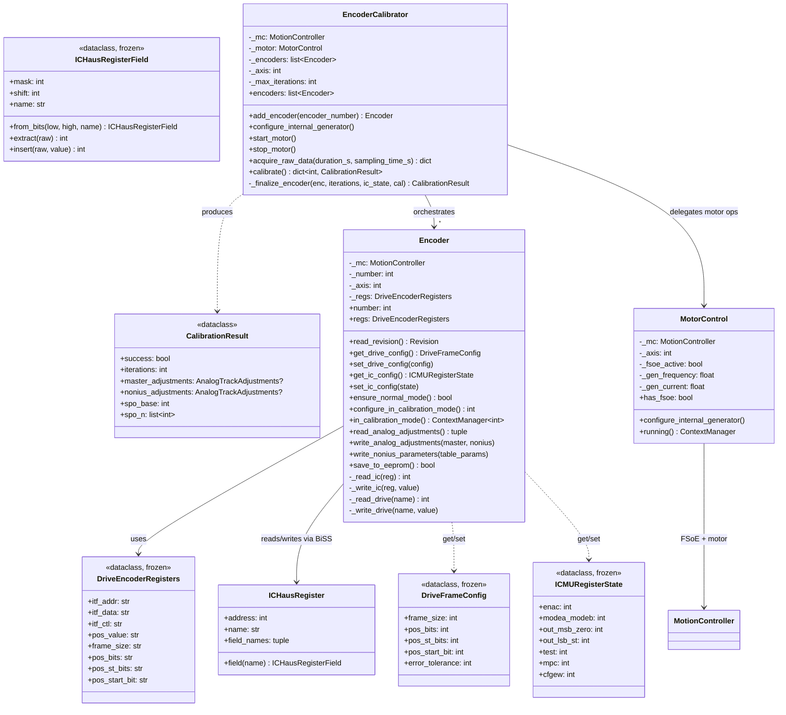

# Architecture: iC-Haus Magnetic Encoder Calibration

Calibration tool for iC-MU magnetic encoders on the DR3256C drive, using BiSS over EtherCAT.

---

## 0. How the iC-MU Encoder Works

### Physical Principle: Two-Track Magnetic Nonius

The iC-MU is a **magnetic off-axis position encoder** using integrated Hall sensors
to scan a ring magnet attached to the motor shaft. It uses the **Nonius principle**
with two sensing tracks of different pole-pair counts:

| Track | Pole pairs | Role |
|-------|-----------|------|
| **Master** | Higher (e.g. 11) | High resolution *within* one pole-pair period |
| **Nonius** | Lower (e.g. 8) | Determines *which* period → absolute position |

By combining both tracks the encoder resolves a unique absolute position across
one full mechanical revolution.

### Analog Signal Conditioning

Each track produces sine + cosine Hall signals. These are conditioned by 4
parameters per track (8 total), stored in EEPROM:

| Param | Master reg | Nonius reg | Purpose |
|-------|-----------|-----------|---------|
| GX    | 0x01      | 0x07      | Cosine gain (amplitude matching) |
| VOSS  | 0x02      | 0x08      | Sine DC offset removal |
| VOSC  | 0x03      | 0x09      | Cosine DC offset removal |
| PH    | 0x04      | 0x0A      | Phase / orthogonality correction |

Factory defaults are generic. **Calibration tunes them for the specific
motor + magnet + sensor assembly**.

### Sine → Digital Conversion

Internal 12-bit (14-bit filtered) converters turn the conditioned sine/cosine
into digital position words:

- **Master position** — 14 bits within one master period
- **Nonius position** — 14 bits within one nonius period

The Nonius calculation engine combines these into an absolute position.
A per-sector offset table (SPO_BASE + SPO\_0…SPO\_14) adds fine correction.

### Operating Modes

**Normal mode** — encoder outputs combined absolute position via BiSS-C:

```
SCD: [19-bit absolute position | nE | nW | CRC-6]  (27 bits)
```

**Raw / calibration mode** (`MODE_ST = RAW`, `OUT_MSB = 0x0E`):

```
SCD: [14-bit nonius | 14-bit master | nE | nW | CRC-6]  (36 bits)
```

Raw mode exposes each track independently so the calibration algorithm can
analyse and correct analog errors per-track.

### BiSS-C Communication

BiSS-C is a synchronous point-to-point serial protocol:

1. Drive (master) generates clock on **MA** line
2. Encoder asserts **ACK** on SCD when data is ready
3. Position data, MSB first
4. **nE** — error bit (active LOW)
5. **nW** — warning bit (active LOW)
6. **CRC** — 6-bit, inverted, polynomial 0x43

### Error / Warning Bit Configuration (CFGEW)

Register **CFGEW** (0x0C) selects which conditions appear on nE / nW.
Encoding: `0 = enabled`, `1 = disabled`.

| Bit | Visible on nE (error) | Condition |
|-----|----------------------|-----------|
| 7 | MT_ERR / MT_CTR | Multiturn errors |
| 6 | NON_CTR | Nonius period-counter error |
| **5** | **Ax_MAX, Ax_MIN** | **Signal-level errors** |
| 4 | EPR_ERR | EEPROM error |
| 3 | CRC_ERR | Internal RAM CRC error |
| 2 | CMD_EXE | Command executing |

| Bit | Visible on nW (warning) | Condition |
|-----|------------------------|-----------|
| 1 | FRQ_CNV / FRQ_ABZ | Frequency warning |
| 0 | Ax_MAX, Ax_MIN | Signal-level warning |

With **CFGEW.bit5 = 0** (default), signal-level errors
(`AM_MIN` / `AN_MIN` in STATUS0) will assert **nE = 0** on every BiSS frame.
An uncalibrated encoder whose signal amplitude is below threshold will
therefore report an error on every frame.

### Uncalibrated Encoder → Drive Fault Chain

When the calibration script enters raw mode and sets **FRAME_SIZE = 36** on
the drive, the full BiSS frame — including nE — is clocked. If the encoder is
uncalibrated:

1. Factory-default analog parameters → signal amplitude may be out of range
2. `AM_MIN` or `AN_MIN` fires (STATUS0), or `CRC_ERR` (STATUS1) asserts
   because the internal EEPROM CRC is invalid for an uncalibrated chip
3. `CFGEW.bit5 = 0` → error propagates to **nE = 0** (active low)
4. Drive reads nE = 0 on each frame → counts a BiSS error
5. After enough consecutive errors → **drive faults** with 0x7380 or 0x7382
6. `motor_enable()` fails

The calibration script mitigates this by writing **`CFGEW = 0xFF`** to the
iC-MU, which disables all error sources from asserting the BiSS nE/nW bits.
This is set in `configure_in_calibration_mode()` and restored to the original
value when calibration mode exits.

The drive-side **`ERROR_TOLERANCE`** register is also set to `0xFFFF` after
the frame geometry change.  Switching from the normal frame (27 bits) to the
calibration raw frame (36 bits) causes transient CRC mismatches; a high
tolerance prevents the drive from freezing POS_VALUE during the transition.

Additionally, `ensure_normal_mode()` is called at the start of every
calibration run to detect and recover an encoder left in RAW mode from a
previous interrupted calibration (e.g., `OUT_MSB = 0x0E` instead of `0x06`).

### Internal CRC Checksums (EEPROM)

The encoder also stores two internal CRCs protecting its configuration RAM:

| CRC | Polynomial | Protects | Address |
|-----|-----------|----------|---------|
| CRC-16 | 0x11021 | Config data (0x00–0x20, 0x30–0x3F) | 0x21–0x22 |
| CRC-8 | 0x197 | Offset/preset data (0x23–0x2E) | 0x2F |

These are checked at startup and optionally during operation (`NCHK_CRC`).
The `WRITE_ALL` command (0x01) automatically recalculates both CRCs.
`STATUS1.CRC_ERR` (bit 7) indicates an invalid internal checksum — this is
distinct from the BiSS frame CRC.

---

## 1. Module Structure




---

## 2. Calibration Flow



---

## 3. Encoder Abstraction



> **Encoder**: Wraps a single iC-MU encoder — BiSS read/write, register save/restore via get/set pattern, analog parameter management, nonius SPO writes, EEPROM save. `ensure_normal_mode()` detects and recovers from interrupted calibration runs. State is not stored internally; the caller (EncoderCalibrator) manages saved configs.
>
> **MotorControl**: Wraps motor operations with transparent FSoE support. Auto-detects drive safety capability, manages the full FSoE lifecycle (start/stop master, STO bypass, PDO watchdog), and handles internal generator configuration with current ramp-up to avoid FSoE PDO starvation.
>
> **EncoderCalibrator**: Orchestrates calibration across N encoders. Delegates all motor and FSoE operations to an internal `MotorControl` instance. Motor is started/stopped per iteration. Data is captured from all encoders simultaneously, then each encoder's calibration proceeds independently.

---

## 4. Design Notes

- **DLL sync**: `set_current_analog_track_adjustments()` is called before every `analyze_raw_data()` to keep the mu_3sl DLL in sync with chip state.
- **Convergence**: Configurable `max_iterations` (default=3). Stops early when all 8 residuals ≤ 1.0 LSB. Non-converged encoders get `CalibrationResult(success=False)`; converged ones proceed to EEPROM save.
- **Guaranteed restore**: `set_drive_config()` and `set_ic_config()` run in the `finally` block. Each restore is individually wrapped so one encoder's failure doesn't block another.
- **Multi-encoder**: `DriveEncoderRegisters` maps both encoder 1 and 2 register names. Motor spins once per iteration; data captured simultaneously from all encoders.
- **Save/restore pattern**: Caller-managed. `Encoder` exposes `get_/set_` methods returning frozen dataclasses.
- **Nonius SPO finalization**: Extra motor spin + data capture after analog convergence to get the best nonius offset table.
- **Motor method**: Internal generator (current mode) with saw-tooth commutation. Configurable via `--gen-current` and `--gen-frequency`.
- **FSoE lifecycle**: `MotorControl` auto-detects FSoE support and manages the safety master transparently. Uses STO bypass mode with `use_sra=True`. PDO watchdog raised to 0.3s. Current ramped in discrete steps with sleeps to avoid PDO starvation.
- **Crash recovery**: `ensure_normal_mode()` detects RAW mode left by interrupted calibrations and restores the encoder to ABS mode before re-entering calibration.
- **ERR/WRN suppression**: `CFGEW=0xFF` disables all iC-MU error sources from asserting the BiSS nE/nW bits during calibration, preventing drive faults on uncalibrated encoders.
- **Logging**: `logging` module throughout. `--verbose` enables DEBUG output.
