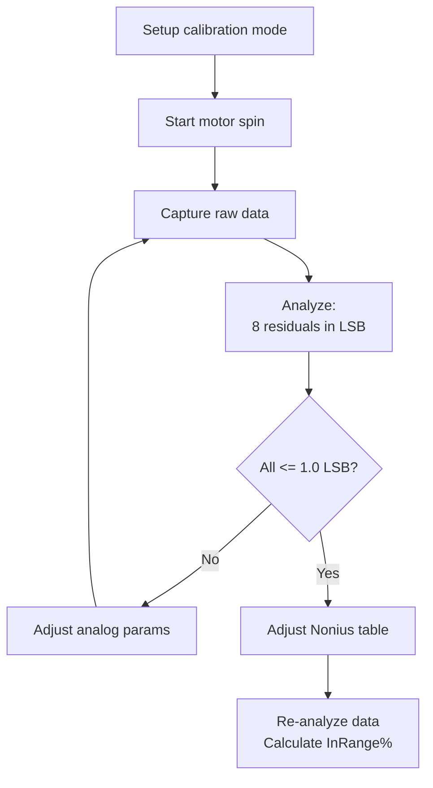

# Calibration Tuning Guide

This guide briefly explains:
- How the calibration procedure works
- What the acquired raw data must look like
- Which parameters affect it
- How to tune them for a calibration that **converges reliably and quickly**.

This document complements [architecture.md](architecture.md), which
describes the module and class structure.

---

## 1. Procedure overview

The procedure for each encoder is:

1. **Setup** — The encoder switches to raw/calibration mode, and its analog
  calibration parameters are reset to factory defaults.
2. **Motor spin** — The motor is driven by the drive's internal saw-tooth current generator
   (`--gen-current`, `--gen-frequency`).
3. **Iterative analog calibration** — For each iteration:
   - Capture raw data samples for `--capture-duration` seconds
     via EtherCAT TPDOs at `--pdo-rate-ms`.
  - Analyze the data to calculate eight analog residuals (cosine gain,
    sine offset, cosine offset, and phase for both the master and Nonius
    tracks), in LSB.
  - If **all eight residuals are ≤ 1.0 LSB**, the iteration converges.
    Otherwise, the analog parameters are corrected and the next iteration
    runs, until convergence or `--max-iterations` is reached.
4. **Nonius calibration** — The Nonius offset table is adjusted using the
  last analyzed result.
5. **Finalization** — The original configuration is restored, and the
  result is saved to EEPROM.

Each iteration needs good-quality raw data; this is the dominant factor in
calibration speed and success.



## 2. Raw data requirements

Raw data must meet the following requirements for calibration to converge
quickly and successfully:

For each magnetic (master) period (360° electrical = one pole pair):

- **≥ 128 samples/master period**
- **At least 2–3 complete mechanical revolutions**
- **Continuous, non-stopping motion**


---

## 3. Parameters to work with

| Parameter | Effect | How to tune | Comment |
|---|---|---|---|
| `--gen-frequency` | Sets the motor rotation speed. | Higher ⇒ faster rotation. | Higher speed with the same `--pdo-rate-ms` produces fewer samples per magnetic period. `--gen-frequency` isn't 1:1 with mechanical RPM (depends on pole-pair count/gearing) but scales monotonically with it.|
| `--gen-current` | Sets the open-loop commutation current. | Increase only until the motor rotates reliably. | It does not directly change the calibration algorithm, but must overcome friction and cogging torque. Excessive current can heat the motor or drive. |
| `--pdo-rate-ms` | Sets the raw-data sampling period. | Lower ⇒ increase samples per magnetic period. | A shorter period increases communication and processing load; but a sample rate that is too low can cause data loss. |
| `--capture-duration` | Sets the acquisition time per iteration. | Higher ⇒ capture more samples and revolutions | Decrease to reduce iteration time once data quality is sufficient. Too short a window may not provide 2–3 complete revolutions. |


---

## 4. Ideal tuning procedure

1. Tune the parameters to obtain good-quality data.
  - Run with the default parameters and `--max-iterations 1`.
  - Check the logs and tune `--gen-frequency`, `--pdo-rate-ms`, and
    `--capture-duration` until `min_samples/period ≥ 128` and `revolutions ≥ 2–3`.

        Example log output for suitable data parameters:
        ```bash
        2026-08-21 12:50:37,335 INFO ic_haus_magnetic_encoder_calibration.calibrator: Encoder 1 iter 1 analysis: valid=True, calc_periods=32, revolutions=2.02, acquired_periods=64.7, avg_samples/period=155.6, min_samples/period=146.8
        ```


2. Once the acquired data meets these requirements, increase
  `--max-iterations` and check whether calibration converges within 3–4
  iterations.
   - Keep `--max-iterations` at its default value or use a lower limit,
    such as `--max-iterations 5`.

3. To reduce execution time, disable diagnostic output by setting these
  flags to `False`: `--save-raw-plots`, `--save-residual-bar-plots`,
  `--save-trend-plot`, `--save-json`, and `--save-nonius-track`.
 

## 5. Tuning troubleshooting

### Calibration does not converge
- Increase samples per period: lower `--pdo-rate-ms` and/or lower
  `--gen-frequency`.
- Increase the number of revolutions: increase `--capture-duration` and/or
  lower `--gen-frequency`.
- Rule out mechanical issues (play, pole-wheel quality, and cogging torque) if
  increasing samples/revolutions doesn't help.
- Rule out drive-to-encoder communication issues by checking the BiSS-C
  parameters.
- Only raise `--max-iterations` once per-iteration data already meets
  the targets above.

### Calibration converges in 3–4 iterations but the process is too slow
- Reduce acquisition time while maintaining data quality
  (`min_samples/period ≥ 128` and `revolutions ≥ 2–3`):
  - lower `--pdo-rate-ms` and `--capture-duration`
  - raise `--gen-frequency` (careful with `samples/period`)
   
### Calibration requires more than four iterations
- Check `avg_samples/period` and `min_samples/period`; both should be
  ≥ 128. If they are too low, increase the sample rate by lowering
  `--pdo-rate-ms`.
- Check `revolutions`; the target is 2–3. If too low, increase
  `--capture-duration` or `--gen-frequency`, while ensuring the samples
  per period remain ≥ 128.

### Calibration converges but has a poor Nonius InRange% margin
The minimum and maximum InRange% values should each be ≤60%. Analog
residuals ≤1.0 LSB do not guarantee this; it is a mechanical-alignment
issue, not a data-acquisition issue.

- Check the air gap and sensor alignment.


## 6. Optimal calibration checklist

- [ ] Motor at steady speed for the whole data capture duration.
- [ ] `min_samples/period` ≥ 128.
- [ ] `revolutions` ≥ 2–3.
- [ ] Residuals ≤1.0 LSB.
- [ ] Nonius minimum and maximum InRange% values ≤60%.


## 7. Further reading

- **[architecture.md](architecture.md)** — Module structure, class
  responsibilities, calibration flow implemented here.
- **[Manuals and datasheets available on the ic-haus website](https://www.ichaus.de/download-center/)**
  — Manuals and datasheets referring to the `mu_3sl` library require a
  special request to iC-Haus.
- **[biss-interface.com](https://www.biss-interface.com)** — BiSS-C
  protocol reference used for encoder communication during calibration.
